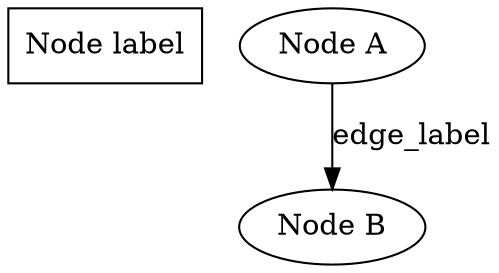
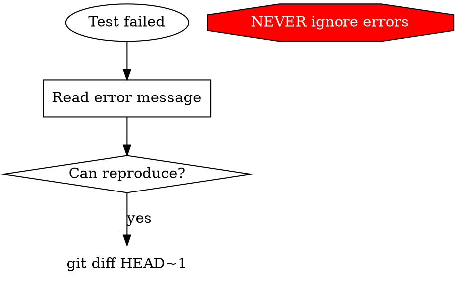
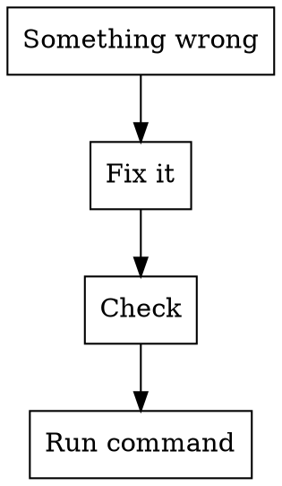
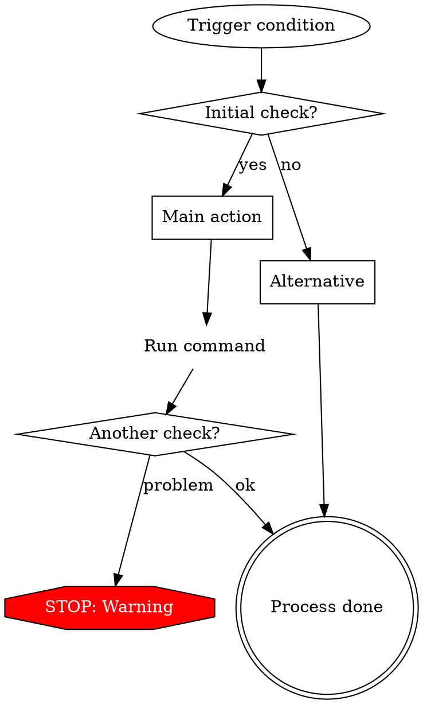

# Flowchart 决策规范

> 从 obra/superpowers v6.1.1 的 graphviz-conventions.dot + writing-skills 的流程图规范提取。

## 核心原则

流程图解决的是**视觉逻辑问题**，不是文字啰嗦的替代。只在以下场景使用：

1. **非显而易见的选择点** — 条件多或复杂
2. **容易提前停下的循环流程** — 需要"还有更多吗？"的检查
3. **"何时用 A vs B"** — 两条路径的分叉

**永远不用：** 参考材料（用表格）、代码示例（用代码块）、线性步骤（用数字列表）

## 输出规范

流程图必须用 **Graphviz DOT 格式**：

## 节点规范

| 类型 | 形状 | 格式 | 示例 |
|------|------|------|------|
| **选择/问题** | `diamond` | 以 `?` 结尾 | `"Have more items?"` |
| **动作** | `box`（默认） | 动词开头 | `"Read next item"` |
| **命令** | `plaintext` | 实际命令 | `"npm test"` |
| **状态** | `ellipse` | 描述状态 | `"Build is broken"` |
| **警告/红灯** | `octagon` | 红色填充 | `"NEVER ignore this"` |
| **入口/出口** | `doublecircle` | 命名清晰 | `"Process starts"` |
| `style=filled, fillcolor=red, fontcolor=white` | 只用于不可协商的禁令 | | |

## 边线标签规范

| 场景 | 标签 | 样式 |
|------|------|------|
| 二选一 | `yes` / `no` | 实线 |
| 多选 | `condition A` / `otherwise` | 实线 |
| 触发关系 | `triggers` | `style=dotted` |

## 命名规范

| 类型 | 格式 | 示例 |
|------|------|------|
| 问题 | 以 `?` 结尾 | `"Is test passing?"` |
| 动作 | 动词开头 | `"Write the test"` |
| 命令 | 实际命令文本 | `"git status"` |
| 状态 | 描述情境 | `"Test is failing"` |
| 步骤 | 无通用标签，用具体名 | 不用 `step1` `step2` |

## 好的流程图 vs 坏的

## 复杂流程图的结构模板

适合需要多次选择+分支的流程：

## 何时不画流程图

| 误用场景 | 正确替代 |
|----------|---------|
| "步骤 1 → 步骤 2 → 步骤 3" | 数字列表 |
| 参数名称和类型 | 表格 |
| 代码场景 | Markdown 代码块 |
| 纯概念描述 | 正文段落 |

## 相关技能

**RECOMMENDED:** `baoyu-skill-craft` — 在 skill 中嵌入流程图时参考其中的形式匹配规范
